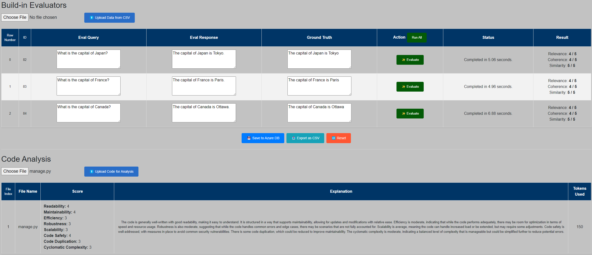

# Prompt Evaluation SDK and Web UI

## Overview

This repository contains two main components:
1. **Prompt Evaluation SDK**:
   A Python library designed to facilitate the evaluation of AI prompts, specifically focusing on Azure OpenAI Services.

2. **Web UI**: 
   A Django-based web application for managing and evaluating AI prompts.

### Prompt Evaluation SDK

1. **Clone the repository**:
    ```sh
    git clone https://github.com/your-username/prompt-eval-sdk.git
    cd prompt-eval-sdk
    ```

2. **Install dependencies**:
    ```sh
    poetry install
    ```

3. **Build the package**:
    ```sh
    poetry build
    ```

4. **Install the package**:
    ```sh
    poetry install
    ```

To evaluate AI prompts using the SDK:

```python
from prompt_eval_sdk.evaluation import Evaluation, EvaluationResult

evaluation = Evaluation()
relevance = evaluation.evaluate_relevance('your_query', 'your_response')
coherence = evaluation.evaluate_coherance('your_query', 'your_response')
similarity = evaluation.evaluate_similarity('your_query', 'your_response', 'your_ground_truth')
result: EvaluationResult = evaluation.evaluate_combined('your_query', 'your_response', 'your_ground_truth')

from prompt_eval_sdk.code_evaluator import CodeQualityEvaluator

model_config = {
    'api_key': 'your-api-key',
    'endpoint': 'your-endpoint',
    'deployment': 'your-deployment'
}

code_evaluator = CodeQualityEvaluator(model_config=model_config)
source_code = """
def example_function():
    print("Hello, world!")
"""
result = code_evaluator(response=source_code)
print(result)
```

### Web UI for Prompt Evaluation

This is a web UI test harness for the SDK. It provides a web interface for managing and evaluating AI prompts.



1. **Create a `.env` file**:
    Create a `.env` file in the `web-ui` directory and add the following environment variables:

    ```env
    DJANGO_SECRET_KEY=your-secret-key
    DJANGO_DEBUG=True
    DJANGO_ALLOWED_HOSTS=localhost,127.0.0.1
    AZURE_OPENAI_ENDPOINT=https://your-azure-endpoint
    AZURE_OPENAI_API_KEY=your-azure-api-key
    AZURE_OPENAI_DEPLOYMENT=your-azure-deployment
    DB_NAME=your-database-name
    DB_USER=your-database-user
    DB_PASSWORD=your-database-password
    DB_HOST=your-database-host
    DB_PORT=your-database-port
    AZURE_LOG_CONNECTION_STRING=your-azure-log-connection-string
    ```

2. **Install dependencies**:
    ```sh
    pip install -r requirements.txt
    ```

3. **Apply database migrations**:
    ```sh
    python manage.py migrate
    ```

4. **Run the development server**:
    ```sh
    python manage.py runserver
    ```

To evaluate AI prompts using the web UI, navigate to `http://localhost:8000` in your web browser and follow the instructions on the interface.